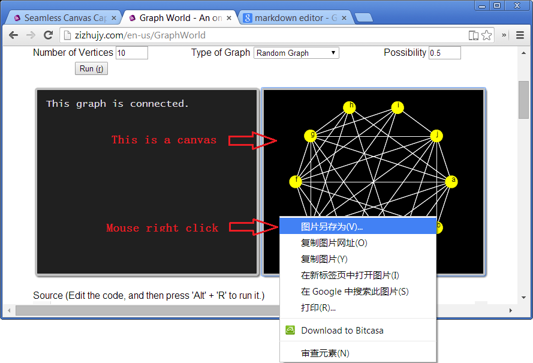

SeamlessCanvasCapture
=====================

Saving the canvas on the web page as the same way you do with the normal images.

Online examples:
================
http://zizhujy.com/GraphWorld

Screenshot:
===========


Usage:
=======
Inside the area of your html page, add the following lines:
```javascript
<script type="text/javascript" src="http://zizhujy.com/Scripts/base64.js"></script>
<script type="text/javascript" src="http://zizhujy.com/Scripts/drawing/canvas2image.js"></script>
<script type="text/javascript" src="http://zizhujy.com/Scripts/jquery.js"></script>
<script type="text/javascript" src="http://zizhujy.com/Scripts/seamlessCanvasCapture.js"></script>
```
Now you are all set. Right click on your canvas, you will see the "Save image as..." option.